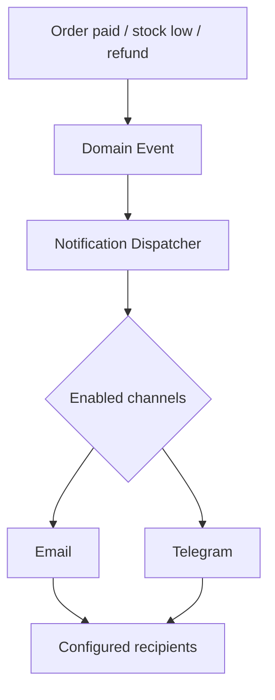

Add a configurable **Notification Center** in Filament. Admin/manager can enable channels, choose recipients, and decide which events trigger email or Telegram messages.

Do not hard-code Telegram chat IDs or email addresses in `.env` except for the initial system defaults.

## Events Worth Notifying

| Event                                  |    Email | Telegram | Recommended recipient |
| -------------------------------------- | -------: | -------: | --------------------- |
| New paid order                         | Optional |      Yes | Shop owner / manager  |
| KHQR payment confirmed                 | Optional |      Yes | Cashier / manager     |
| Payment failed or expired              |       No | Optional | Cashier               |
| Refund / void order                    |      Yes |      Yes | Owner / manager       |
| Low inventory                          |      Yes |      Yes | Manager               |
| Daily sales summary                    |      Yes |      Yes | Owner                 |
| Failed payment gateway / printer error |      Yes |      Yes | Admin                 |
| New staff account / role change        |      Yes | Optional | Admin                 |

For a coffee shop, Telegram is best for real-time operational alerts; email is better for daily summaries, audit records, and problems needing a paper trail.

## Clean Laravel Design



```text
app/Domain/Notifications/
  Events/
    OrderPaid.php
    PaymentFailed.php
    LowStockDetected.php
    DailySalesClosed.php
  Listeners/
    SendOrderPaidNotification.php
    SendLowStockNotification.php
  Notifications/
    OrderPaidNotification.php
    LowStockNotification.php
  Channels/
    TelegramChannel.php
  Services/
    NotificationSettingsService.php
```

Use Laravel Events, Listeners, Notifications, and Queues. Your POS should finish the sale first; notifications run afterward. A Telegram outage must never block a customer’s payment or receipt.

## Filament Interface

Create a **Notifications** area in `/admin`.

| Page              | Admin controls                                                 |
| ----------------- | -------------------------------------------------------------- |
| Channels          | Enable/disable Email and Telegram                              |
| Email settings    | Mail driver, sender name/address, recipient emails, test email |
| Telegram settings | Bot token, chat IDs, recipient name, test message              |
| Event rules       | Toggle each event per channel                                  |
| Templates         | Subject/message templates with variables                       |
| Delivery logs     | Sent, failed, retrying, error message, sent time               |

Example event rule:

```text
Event: Low Stock
Email: Enabled
Telegram: Enabled
Recipients: Owner, Inventory Manager
Threshold: 5 units
Cooldown: 12 hours
```

## Database

```text
notification_channels
- id
- code                  # email, telegram
- is_enabled
- settings              # encrypted JSON
- created_at
- updated_at

notification_recipients
- id
- channel_code
- name
- destination           # email address or Telegram chat ID
- is_active

notification_rules
- id
- event_code            # order_paid, low_stock, daily_sales_summary
- channel_code
- is_enabled
- template_id
- cooldown_minutes

notification_logs
- id
- event_code
- channel_code
- recipient
- status                # queued, sent, failed
- payload
- error_message
- sent_at
```

Encrypt sensitive values such as the Telegram bot token and SMTP password. Laravel’s encrypted casts are suitable:

```php
protected function casts(): array
{
    return [
        'settings' => 'encrypted:array',
    ];
}
```

## Telegram Setup

1. Create a Telegram bot using `@BotFather`.
2. Store the bot token in the admin interface, encrypted.
3. Add the bot to the owner/manager Telegram group.
4. Obtain and store the group `chat_id`.
5. Click **Send Test Message** before enabling production notifications.

Use a Telegram group, not one personal chat ID. It survives staff changes much better.

## Important Safeguards

* Queue all notifications; retry failed jobs with exponential backoff.
* Add cooldowns to low-stock alerts so the owner does not receive 200 identical messages.
* Do not send customer names, phone numbers, card data, bank account details, or full payment payloads to Telegram.
* Log notification delivery attempts, but mask credentials and sensitive payment references.
* For daily summaries, schedule Laravel’s command after the shop closes and send one final report.
* Add a “test channel” button for email and Telegram before saving/enabling each configuration.

This turns notifications into a reusable module: today email + Telegram, later SMS, WhatsApp, OneSignal, or Slack can plug into the same event and rule system.
