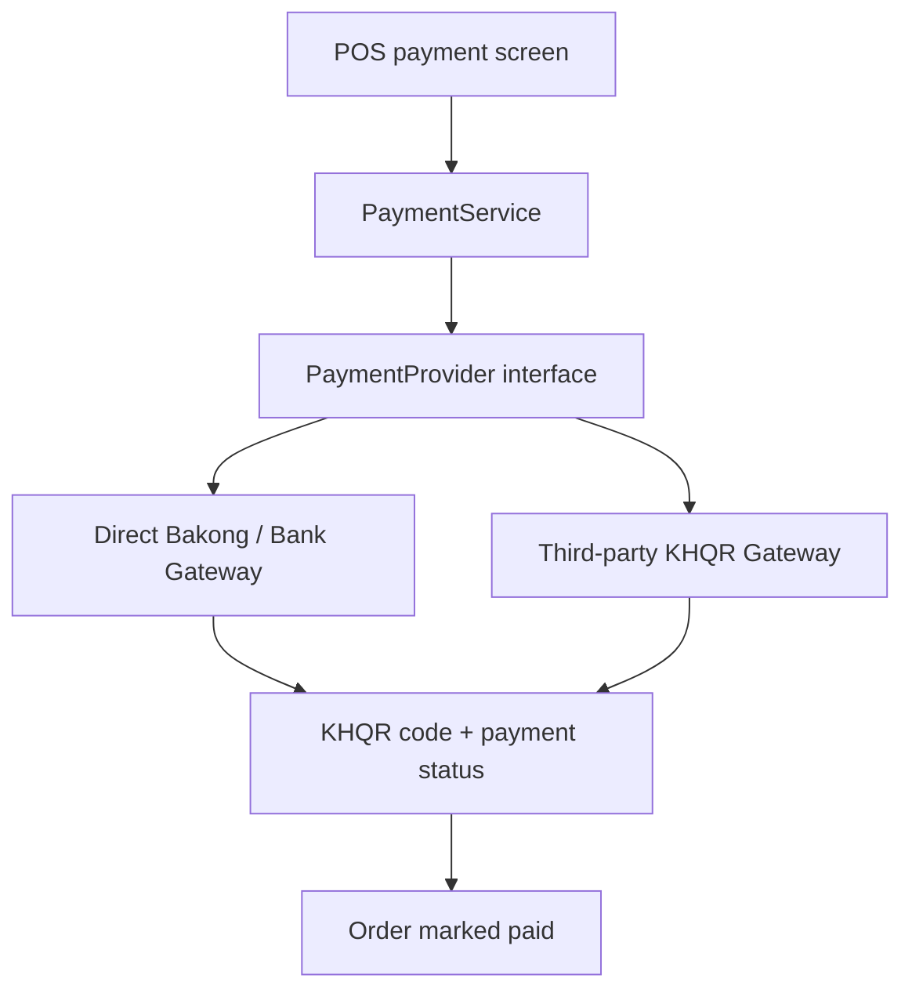

Yes. Build a **payment-provider layer** so the POS can switch between direct KHQR/Bakong integration and third-party APIs without changing order logic.

One correction: **hosting in Cambodia vs outside Cambodia should not decide the provider.** What matters is the merchant’s account, KYC/contract, API credentials, allowed callback URL, costs, and support. A VPS in Singapore can call a Cambodian payment API; HTTPS/webhook reliability matters more than server country.

KHQR lets customers pay from participating Cambodian bank and wallet apps using one QR standard.

## Recommended Design



```php
interface PaymentProvider
{
    public function createQr(PaymentRequest $request): PaymentQr;
    public function checkStatus(string $providerReference): PaymentStatus;
    public function verifyWebhook(array $payload, array $headers): PaymentStatus;
}
```

Implement providers separately:

```text
app/Domain/Payment/
  Contracts/PaymentProvider.php
  Data/PaymentRequest.php
  Data/PaymentQr.php
  Providers/
    BakongProvider.php
    AbaPayWayProvider.php
    ThirdPartyKhqrProvider.php
  PaymentManager.php
```

## Provider Choice

| Situation                                                                            | Recommended provider                                                                     |
| ------------------------------------------------------------------------------------ | ---------------------------------------------------------------------------------------- |
| Merchant has a direct official bank/Bakong merchant account and supported API access | Use the bank or Bakong integration directly                                              |
| Merchant needs quickest integration or uses multiple payment methods                 | Use a reputable third-party KHQR gateway                                                 |
| Merchant changes provider later                                                      | Change a setting; keep orders/payments unchanged                                         |
| Internet unavailable                                                                 | Accept cash and keep a static KHQR display as fallback, but require cashier confirmation |

Some third-party platforms advertise KHQR QR generation, status checks, and webhooks, while others also combine KHQR with ABA PayWay. Verify the provider’s licensing, merchant settlement, reliability, fees, and support before committing.

## Database

```text
payment_providers
- id
- code                 # bakong, aba_payway, third_party
- name
- is_active
- config               # encrypted JSON credentials
- settings             # currency, expiry, webhook options

payments
- id
- order_id
- provider_code
- method               # cash, khqr, card
- amount
- currency             # KHR or USD
- status               # pending, paid, failed, expired, refunded
- provider_reference
- provider_payload     # JSON for audit/debugging
- paid_at
```

For a single shop, use Laravel configuration first:

```env
PAYMENT_PROVIDER=third_party_khqr
```

When you later support multiple branches or merchants, move provider selection into the `branches` or `payment_providers` table.

## Non-Negotiable Rules

* Generate a **dynamic KHQR QR per order**, with exact amount, currency, expiry, and unique order reference.
* Never mark an order paid because the cashier or browser says “payment successful.”
* Confirm payment through a signed webhook, then verify the provider reference server-to-server.
* Make webhook processing idempotent: repeated callbacks must not create duplicate payments.
* Store API keys encrypted and never expose them in Blade/Livewire/JavaScript.
* Keep `cash`, `KHQR`, `ABA PayWay`, and later `card` as separate payment methods under the same interface.
* Always allow the cashier to cancel an expired pending QR and generate a new one.

For your project, I would launch with:

```text
Cash
KHQR dynamic QR via configurable provider
Static shop KHQR as emergency fallback
```

Then add ABA PayWay/card only if the owner truly needs online payment or foreign cards.


### Payment config [payment_config.md](payment_config.md)
