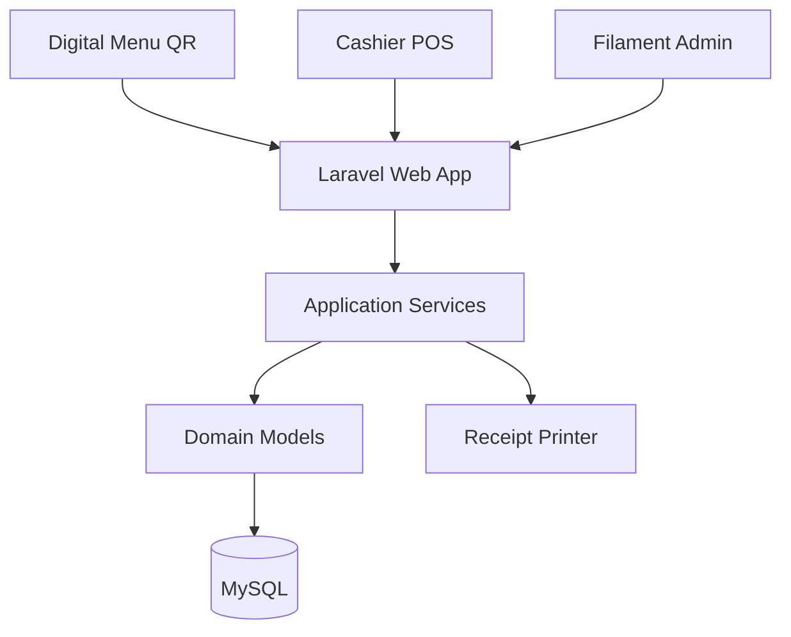

For a small coffee shop, a simple POS System is the right project. A PC and receipt printer are enough for the first version.
Core features:
Staff login
Menu management: coffee, food, price, availability
Create orders and add items
Calculate subtotal, discount, tax, and payment
Print receipt
Daily sales report
Order history
Basic inventory for ingredients or products
Recommended stack:
Frontend: Laravel Blade + Tailwind/Filament
Backend: Laravel
Database: MySQL
Hardware: Windows PC, USB/Bluetooth receipt printer, optional barcode scanner and cash drawer


Add a Digital Menu. For a small coffee shop, the best first version is a QR-code menu: customers scan it and view the menu on their phone. No app or extra hardware needed.
Digital Menu features
QR code displayed on each table and at the counter
Mobile-friendly menu page
Categories: Coffee, Tea, Food, Dessert
Product image, name, description, price, availability
“Sold out” items hidden or clearly marked
Khmer and English support if needed
Admin updates products once in Filament; the digital menu updates immediately


For this coffee-shop POS + QR digital menu, use a **modular Laravel monolith**. It is clean, scalable, deployable on normal shared hosting/VPS, and far more sensible than microservices for one shop.

Do **not** build microservices, separate APIs, Kafka, or Redis queues on day one. That is engineering theater for this scope.

## Recommended Architecture



### Main modules

```text
app/
  Domain/
    Catalog/
      Models/
      Actions/
      Policies/
    Ordering/
      Models/
      Actions/
      Events/
    Inventory/
      Models/
      Actions/
    Reporting/
      Actions/
    Shared/
      Enums/
      ValueObjects/

  Http/
    Controllers/
      Menu/
      Pos/
    Requests/
    Middleware/

  Filament/
    Resources/
    Pages/

  Livewire/
    Pos/
    DigitalMenu/

  Services/
    ReceiptPrinterService.php
    QrCodeService.php
```

Use **Actions** for business operations. Avoid putting real business logic inside Controllers, Filament Resources, or Eloquent models.

Example:

```text
CreateOrderAction
AddOrderItemAction
ProcessPaymentAction
CompleteOrderAction
CancelOrderAction
AdjustInventoryAction
GenerateDailySalesReportAction
```

## Database Design

| Module    | Core tables                                                 |
| --------- | ----------------------------------------------------------- |
| Users     | `users`, `roles`, `permissions`                             |
| Catalog   | `categories`, `products`, `product_prices`                  |
| POS       | `orders`, `order_items`, `payments`, `order_status_logs`    |
| Inventory | `inventory_items`, `stock_movements`, `product_ingredients` |
| Shop      | `branches`, `tables`, `settings`                            |
| Reporting | Derived from orders; do not create report tables initially  |

Important design choices:

* Use `decimal(12,2)` for all money. Never use `float`.
* Store the sold price in `order_items.unit_price`; do not rely on current `products.price`.
* Store `subtotal`, `discount_amount`, `tax_amount`, and `total_amount` in `orders`.
* Use order statuses: `draft`, `pending`, `paid`, `completed`, `cancelled`, `refunded`.
* Track stock changes through `stock_movements`; never just subtract stock silently.
* Add `branch_id` now, even if there is only one shop. It makes multi-branch possible later without redesigning every table.

## Interfaces

| Interface  | Responsibility                                            |
| ---------- | --------------------------------------------------------- |
| `/menu`    | Public QR digital menu, no login                          |
| `/pos`     | Fast cashier ordering and payment                         |
| `/admin`   | Filament: products, categories, users, inventory, reports |
| `/kitchen` | Later: kitchen order display                              |
| `/api/v1`  | Later: mobile app, online ordering, integrations          |

The public QR menu and cashier POS must use the **same `products` table**. Admin changes price, photo, or availability once; both screens update immediately.

## Scalable Rules

1. Start with Laravel Blade + Livewire + Filament, not Next.js. POS and admin need speed of development and one deployable app.
2. Use Laravel Policies and `spatie/laravel-permission` for `admin`, `manager`, and `cashier`.
3. Put receipt printing, QR generation, and stock calculations behind services/actions so hardware or implementation changes do not infect the whole app.
4. Add database indexes early: `orders(branch_id, status, created_at)`, `order_items(order_id)`, `products(category_id, is_available)`.
5. Use Laravel queues later for report exports, notifications, image resizing, and remote printer jobs. Payment and stock confirmation should stay synchronous and transactional.
6. Wrap payment completion, order completion, and stock updates in one database transaction.
7. Add audit logs for price edits, refunds, stock adjustments, and deleted/cancelled orders.

## Build Order

1. Authentication, roles, products, categories, product images.
2. Public QR digital menu.
3. Cashier POS, cart, payments, order history, receipt printing.
4. Daily sales dashboard and basic reports.
5. Inventory and ingredient recipes.
6. Tables, customer QR ordering, kitchen display, multi-branch support.

This gives you a genuinely clean foundation without building a system that is too big to finish.

## Payment -> [payment_plan.md](payment_plan.md)

## Feature functional POS [pos.md](pos.md)

## Notification System [notification.md](notification.md)

## Priority [prority.md](priority.md)

## UI [ui_improvement.md](ui_improvement.md)
