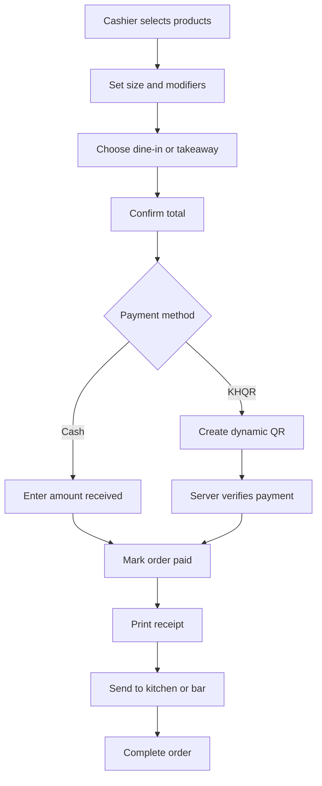

## POS Functions for Small Coffee Shop

Build these first. They are the functions that make the system useful in a real shop.

| Module        | Functions                                                                                      |
| ------------- | ---------------------------------------------------------------------------------------------- |
| Login & roles | Admin, manager, cashier login; restrict refunds, discounts, and reports by role                |
| POS checkout  | Product grid, category filter, search, cart, quantity controls, notes, remove item             |
| Order types   | Dine-in, takeaway, delivery; table number for dine-in                                          |
| Menu          | Product name, photo, category, price, availability, hot/iced options, sizes                    |
| Modifiers     | Size, sugar level, ice level, extra shot, toppings, special instructions                       |
| Payment       | Cash, KHQR dynamic QR, optional ABA/card; split payment later                                  |
| Receipt       | Receipt number, shop information, items, total, payment method, QR/order code                  |
| Order state   | `draft`, `pending payment`, `paid`, `preparing`, `ready`, `completed`, `cancelled`, `refunded` |
| Order history | Search by receipt number, date, cashier, order type, payment status                            |
| Daily closing | Total sales, cash total, KHQR total, refunds, discount total, cashier closing balance          |
| Reports       | Daily/weekly/monthly sales, sales by product/category, payment method, top products            |
| Products      | CRUD categories/products, price, image, sold-out toggle                                        |
| Digital menu  | QR code leads to `/menu`; show menu, price, images, modifiers, sold-out state                  |
| Inventory     | Stock items, stock-in, stock adjustments, low-stock warning, ingredient deduction              |
| Audit         | Record discounts, voids, refunds, manual price changes, stock adjustments, user who did it     |

## Essential POS Workflow



## Must-Have Coffee Features

A generic retail POS is not enough. Coffee shops need these fields:

```text
Product: Latte
Size: Small / Medium / Large
Temperature: Hot / Iced
Sugar: 0% / 25% / 50% / 75% / 100%
Ice: No ice / Less / Normal / Extra
Extras: Espresso shot / Pearl / Whipped cream
Note: “Less sweet, please”
```

Model them cleanly:

```text
products
product_variants          # Small, Medium, Large
modifier_groups           # Sugar level, ice level, extras
modifier_options          # 50%, less ice, pearl
product_modifier_groups   # connects products to allowed modifiers
order_items
order_item_modifiers      # snapshot of selections and price
```

Do not store customization only as a plain text note. You will lose accurate pricing, sales data, and inventory calculations.

## Build in This Order

1. Login, users, categories, products, availability.
2. Cashier POS: cart, order types, cash payment, receipt, order history.
3. Dynamic KHQR payment using the configurable provider architecture.
4. Public QR digital menu sharing the same products and availability.
5. Sales report and daily closing.
6. Coffee modifiers and kitchen/bar ticket printing.
7. Inventory recipes and low-stock alerts.
8. Customer QR ordering, delivery, loyalty points, multi-branch.

## Do Not Add Initially

* Customer accounts and registration
* Loyalty points
* Delivery-driver management
* Complex accounting
* Multi-branch synchronization
* Online payment cards
* Offline synchronization

Finish the core sale flow first: **take order -> receive verified payment -> print receipt -> prepare drink -> report sale**. Everything else is secondary.
