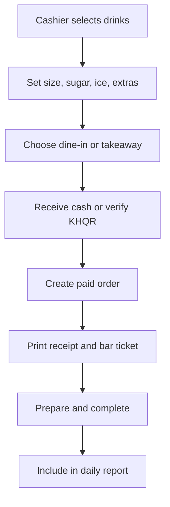

For a small cafe POS, keep the first version focused on operations that happen every day.

| Priority | Feature                     | Why it matters                                                  |
| -------- | --------------------------- | --------------------------------------------------------------- |
| Must     | Cashier login and roles     | Know who created, discounted, cancelled, or refunded an order   |
| Must     | Product/category management | Manage coffee, food, prices, pictures, and sold-out items       |
| Must     | Fast POS cart               | Select items, quantity, notes, remove items, calculate totals   |
| Must     | Coffee modifiers            | Size, hot/iced, sugar, ice, toppings, extra shot                |
| Must     | Order type                  | Dine-in, takeaway, delivery; table number for dine-in           |
| Must     | Cash and KHQR payments      | Covers the real payment flow in Cambodia                        |
| Must     | Receipt printing            | Give customer proof and send ticket to bar/kitchen              |
| Must     | Order status                | Pending, paid, preparing, ready, completed, cancelled           |
| Must     | Daily sales report          | Total sales by cash/KHQR, discounts, refunds, order count       |
| Must     | Order history               | Search old orders by receipt number, date, cashier, payment     |
| Must     | QR digital menu             | Customers scan and view live menu, prices, product photos       |
| Should   | Product availability        | One-click “sold out” control that updates POS and QR menu       |
| Should   | Discount control            | Percentage/fixed discount, manager approval, audit record       |
| Should   | Refund/void control         | Manager-only, reason required, notification sent                |
| Should   | Basic inventory             | Stock in/out, low-stock warning, ingredient usage               |
| Should   | Telegram/email alerts       | Low stock, refund, payment issue, daily sales summary           |
| Later    | Kitchen display             | Barista sees paid orders on tablet/screen                       |
| Later    | Customer QR ordering        | Customer orders from menu; needs table validation and anti-spam |
| Later    | Loyalty points              | Customer phone-based rewards                                    |
| Later    | Delivery integration        | Only if the shop really delivers regularly                      |
| Later    | Multi-branch                | Add when there is actually a second branch                      |
| Later    | Advanced accounting         | Export sales first; full accounting is a separate system        |

A good small-shop screen set:

```text
/admin          Filament dashboard and management
/pos            Cashier screen
/menu           Public QR digital menu
/kitchen        Optional barista order screen
/reports        Sales and daily closing reports
```

The one workflow that must be bulletproof:



Do not start with loyalty, delivery, customer accounts, or multi-branch. Build the sale workflow, QR menu, receipt, KHQR verification, and report correctly first.
